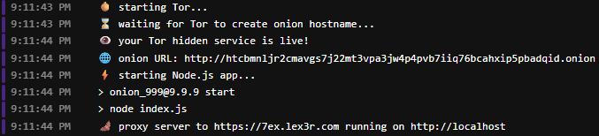

### onion_999

Clearnet-Tor bridge, an app proxy hosting for the Tor network

- Docker container with Tor service and Node.js express proxy app
- generates a new .onion URL on start and forwards traffic to the Clearnet URL specified in the `CLEARNET_URL` env

#### SYSTEM
- Docker

#### RUN
```sh
sh bin/run.sh
# or
docker run -p 80:80 7exlex3r/onion_999:latest
# or with specified custom url
docker run -p 80:80 -e CLEARNET_URL="https://7ex.lex3r.com" 7exlex3r/onion_999:latest
```

#### ENV
- CLEARNET_URL = https://7ex.lex3r.com

#### USAGE EXAMPLE
- go to https://www.runpod.io
- create a **CPU** pod template
  - use **docker.io/7exlex3r/onion_999** as the Docker image
  - add **CLEARNET_URL** env with the target page URL
  - expose HTTP port **80**
  - use default/minimal container disk size
- run a pod using the created template
- open the container logs to see the .onion URL

- open **Tor Browser**, navigate to the generated **onion URL**